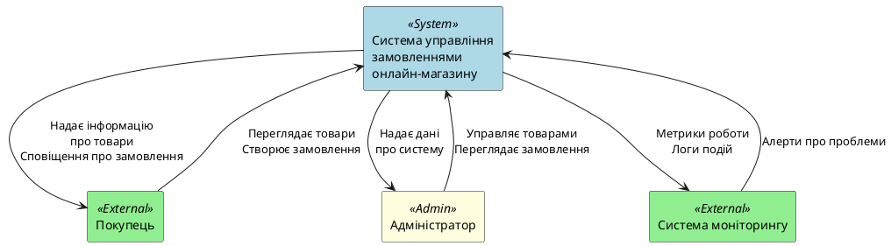
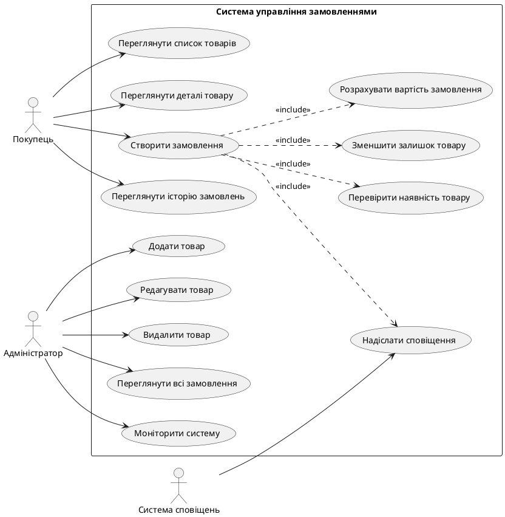

# ЛАБОРАТОРНА РОБОТА №1
## Аналіз вимог до розподіленої системи

**Тема проекту:** Система управління замовленнями у невеликому онлайн-магазині

**Виконав:** Бородій Богдан Сергійович 
**Група:** ІПЗм-25
**Дата:** 15.11.2025

---

## 1. МЕТА РОБОТИ

Навчитися визначати функціональні та нефункціональні вимоги до розподіленої програмної системи (РПС), ідентифікувати користувачів системи, описати контекст її функціонування та побудувати відповідні діаграми.

---

## 2. КОРОТКІ ТЕОРЕТИЧНІ ВІДОМОСТІ

**Розподілена система** — це сукупність незалежних обчислювальних вузлів, які взаємодіють між собою через мережу для досягнення спільної мети.

**Основні властивості РПС:**
- **Масштабованість** — можливість додавати нові вузли без зупинки системи
- **Надійність** — здатність працювати при відмові окремих вузлів
- **Доступність** — відсоток часу, коли система доступна користувачам
- **Узгодженість** — однаковий стан даних у різних вузлах
- **Безпека** — захист даних від несанкціонованого доступу

**Функціональні вимоги** описують, що система повинна робити.  
**Нефункціональні вимоги** описують, як система повинна працювати.

---

## 3. ОПИС ПРЕДМЕТНОЇ ОБЛАСТІ

### 3.1. Загальний опис системи

**Система управління замовленнями у невеликому онлайн-магазині** — це розподілена програмна система, яка забезпечує автоматизацію процесів купівлі товарів онлайн.

**Основні бізнес-процеси:**
1. Перегляд каталогу товарів покупцем
2. Створення замовлення на обрані товари
3. Перевірка наявності товарів на складі
4. Резервування товарів для замовлення
5. Оновлення залишків товарів
6. Надсилання сповіщень про статус замовлення

**Архітектурний підхід:** Мікросервісна архітектура з асинхронною взаємодією через брокер повідомлень.

### 3.2. Користувачі системи

Система має три основні групи користувачів:

#### Зовнішні користувачі:
- **Покупець** — кінцевий користувач, який:
  - Переглядає каталог товарів
  - Створює замовлення
  - Отримує сповіщення про статус замовлення

#### Внутрішні користувачі:
- **Адміністратор магазину** — управляє системою:
  - Додає, редагує, видаляє товари
  - Переглядає всі замовлення
  - Контролює залишки на складі
  - Моніторить роботу системи

#### Інтегровані системи:
- **Система сповіщень** — автоматично обробляє події та надсилає повідомлення
- **Система моніторингу** — збирає метрики роботи всіх компонентів

---

## 4. ФУНКЦІОНАЛЬНІ ВИМОГИ

### FR-1. Управління товарами

**FR-1.1.** Система повинна дозволяти адміністратору додавати нові товари до каталогу з вказівкою:
- Назви товару
- Опису
- Ціни
- Кількості на складі

**FR-1.2.** Система повинна дозволяти адміністратору редагувати інформацію про існуючі товари.

**FR-1.3.** Система повинна дозволяти адміністратору видаляти товари з каталогу.

**FR-1.4.** Система повинна надавати покупцям можливість переглядати список всіх доступних товарів.

**FR-1.5.** Система повинна надавати покупцям можливість переглядати детальну інформацію про товар.

**FR-1.6.** Система повинна перевіряти наявність товару на складі перед створенням замовлення.

### FR-2. Управління замовленнями

**FR-2.1.** Система повинна дозволяти покупцю створювати нове замовлення з вказівкою:
- ID товару
- Кількості одиниць

**FR-2.2.** Система повинна автоматично розраховувати загальну вартість замовлення.

**FR-2.3.** Система повинна перевіряти достатність товарів на складі перед підтвердженням замовлення.

**FR-2.4.** Система повинна зберігати інформацію про всі створені замовлення.

**FR-2.5.** Система повинна надавати можливість переглядати історію замовлень.

**FR-2.6.** Система повинна відслідковувати статус кожного замовлення (новий, в обробці, виконаний).

### FR-3. Оновлення залишків

**FR-3.1.** Система повинна автоматично зменшувати кількість товарів на складі після створення замовлення.

**FR-3.2.** Система повинна забезпечувати узгодженість даних про залишки між усіма компонентами.

**FR-3.3.** Система повинна запобігати створенню замовлення, якщо товару недостатньо на складі.

### FR-4. Система сповіщень

**FR-4.1.** Система повинна автоматично надсилати сповіщення покупцю про успішне створення замовлення.

**FR-4.2.** Система повинна надсилати сповіщення про зміну статусу замовлення.

**FR-4.3.** Система повинна логувати всі надіслані сповіщення для аудиту.

---

## 5. НЕФУНКЦІОНАЛЬНІ ВИМОГИ

### NFR-1. Продуктивність

**NFR-1.1.** Середній час відповіді API для операцій читання повинен бути ≤ 200 мс.

**NFR-1.2.** Середній час відповіді API для операцій запису повинен бути ≤ 500 мс.

**NFR-1.3.** Система повинна підтримувати до 100 одночасних користувачів без деградації продуктивності.

**NFR-1.4.** Час обробки події через брокер повідомлень повинен бути ≤ 1 секунди.

### NFR-2. Масштабованість

**NFR-2.1.** Система повинна підтримувати горизонтальне масштабування шляхом додавання нових екземплярів мікросервісів.

**NFR-2.2.** Кожен мікросервіс повинен бути незалежним і може масштабуватися окремо.

**NFR-2.3.** Система повинна підтримувати до 10 000 товарів у каталозі.

**NFR-2.4.** Система повинна підтримувати до 1 000 замовлень на день.

### NFR-3. Надійність

**NFR-3.1.** Доступність системи повинна становити не менше 99.5% (downtime ≤ 3.6 години на місяць).

**NFR-3.2.** Система повинна продовжувати роботу при відмові окремого мікросервісу.

**NFR-3.3.** Повідомлення в черзі RabbitMQ не повинні втрачатися (guaranteed delivery).

**NFR-3.4.** Система повинна підтримувати автоматичне відновлення після збоїв.

**NFR-3.5.** База даних повинна мати щоденне резервне копіювання.

### NFR-4. Безпека

**NFR-4.1.** API endpoints повинні бути захищені від несанкціонованого доступу.

**NFR-4.2.** Всі чутливі дані (паролі, токени) повинні зберігатися в зашифрованому вигляді.

**NFR-4.3.** Міжсервісна взаємодія повинна бути захищена (HTTPS, authentication).

**NFR-4.4.** Система повинна логувати всі спроби доступу до критичних операцій.

### NFR-5. Підтримка та моніторинг

**NFR-5.1.** Кожен мікросервіс повинен надавати endpoint для health check.

**NFR-5.2.** Система повинна збирати метрики роботи (CPU, RAM, latency, throughput).

**NFR-5.3.** Логи всіх сервісів повинні централізовано зберігатися і бути доступними для пошуку.

**NFR-5.4.** Система повинна надсилати алерти при виникненні критичних помилок.

### NFR-6. Розгортання

**NFR-6.1.** Кожен мікросервіс повинен бути контейнеризованим (Docker).

**NFR-6.2.** Система повинна підтримувати розгортання через Docker Compose.

**NFR-6.3.** Система повинна мати документацію для розгортання в Kubernetes.

**NFR-6.4.** Оновлення сервісів повинні відбуватися без простою (rolling updates).

---

## 6. ТОЧКИ ВЗАЄМОДІЇ

### 6.1. Веб-інтерфейс
- **Покупці:** Перегляд товарів, створення замовлень
- **Адміністратори:** Управління товарами, перегляд замовлень

### 6.2. REST API
- **Product Service:** CRUD операції над товарами
- **Order Service:** Створення та перегляд замовлень

### 6.3. Асинхронна взаємодія (RabbitMQ)
- **OrderCreated event:** Публікується Order Service, споживається Product Service та Notification Service

### 6.4. База даних
- **products_db:** PostgreSQL база для Product Service
- **orders_db:** PostgreSQL база для Order Service

---

## 7. КОНТЕКСТНА ДІАГРАМА (Context Diagram)

Контекстна діаграма показує систему як "чорну скриньку" та її взаємодію із зовнішніми акторами.

---

## 8. ДІАГРАМА ПРЕЦЕДЕНТІВ (Use Case Diagram)

Діаграма прецедентів показує функціональність системи з точки зору користувачів.

---

## 9. ТИПОВІ РИЗИКИ ПРИ ПРОЄКТУВАННІ

### 9.1. Технічні ризики

**Р-1. Втрата повідомлень у RabbitMQ**
- **Ймовірність:** Середня
- **Вплив:** Високий (втрата узгодженості даних)
- **Мітігація:** Налаштування persistent messages, acknowledge modes

**Р-2. Перевантаження Product Service при піковому навантаженні**
- **Ймовірність:** Висока
- **Вплив:** Середній (затримки у відповідях)
- **Мітігація:** Горизонтальне масштабування, кешування

**Р-3. Розбіжність даних між сервісами**
- **Ймовірність:** Середня
- **Вплив:** Високий (некоректні замовлення)
- **Мітігація:** Eventual consistency, компенсаційні транзакції

### 9.2. Операційні ризики

**Р-4. Відмова одного з мікросервісів**
- **Ймовірність:** Середня
- **Вплив:** Середній
- **Мітігація:** Health checks, auto-restart, circuit breaker pattern

**Р-5. Переповнення бази даних**
- **Ймовірність:** Низька
- **Вплив:** Високий
- **Мітігація:** Регулярне очищення старих даних, архівування

---

## 10. ВПЛИВ ВИМОГ НА ВИБІР АРХІТЕКТУРНОГО СТИЛЮ

### 10.1. Чому мікросервісна архітектура?

**Обґрунтування вибору:**

1. **Масштабованість (NFR-2):** Мікросервіси дозволяють масштабувати Product Service та Order Service незалежно один від одного.

2. **Надійність (NFR-3):** При відмові одного сервісу (наприклад, Notification Service) інші продовжують працювати.

3. **Незалежність розробки:** Різні команди можуть працювати над різними сервісами паралельно.

4. **Технологічна гнучкість:** Можна використовувати різні технології для різних сервісів.

### 10.2. Чому асинхронна взаємодія (RabbitMQ)?

1. **Слабке зв'язування:** Сервіси не залежать напряму один від одного.

2. **Надійність доставки:** Повідомлення не втрачаються навіть якщо споживач тимчасово недоступний.

3. **Масштабованість:** Можна додавати нових споживачів без зміни publisher'а.

4. **Відповідає бізнес-процесу:** Оновлення залишків не потребує негайної відповіді.

---

## 11. ВИСНОВКИ

У ході виконання лабораторної роботи №1 було проведено аналіз вимог до розподіленої системи управління замовленнями у невеликому онлайн-магазині.

**Основні результати:**

1. **Визначено користувачів системи:** покупці, адміністратори, інтегровані системи.

2. **Сформульовано 16 функціональних вимог**, які охоплюють:
   - Управління товарами (6 вимог)
   - Управління замовленнями (6 вимог)
   - Оновлення залишків (3 вимоги)
   - Систему сповіщень (3 вимоги)

3. **Визначено 16 нефункціональних вимог** у категоріях:
   - Продуктивність (4 вимоги)
   - Масштабованість (4 вимоги)
   - Надійність (5 вимог)
   - Безпека (4 вимоги)
   - Підтримка та моніторинг (4 вимоги)
   - Розгортання (4 вимоги)

4. **Побудовано Context Diagram**, яка показує взаємодію системи з зовнішніми акторами.

5. **Побудовано Use Case Diagram**, яка деталізує функціональні можливості системи.

6. **Ідентифіковано 5 основних ризиків** та визначено стратегії їх мітігації.

7. **Обґрунтовано вибір мікросервісної архітектури** на основі вимог до масштабованості, надійності та незалежності розробки.

Проведений аналіз вимог створює міцну основу для подальшого проєктування архітектури системи в наступних лабораторних роботах.

---

## 12. ВІДПОВІДІ НА КОНТРОЛЬНІ ЗАПИТАННЯ

**1. Що таке розподілена система?**

Розподілена система — це сукупність незалежних обчислювальних вузлів (серверів, контейнерів, пристроїв), які взаємодіють між собою через мережу для досягнення спільної мети. У нашому випадку це Product Service, Order Service та Notification Service, які працюють незалежно, але разом формують систему управління замовленнями.

**2. Які типи архітектур використовуються у розподілених системах?**

Основні типи:
- **Клієнт-сервер** — централізований сервер обслуговує множину клієнтів
- **Мікросервісна** — застосунок розділений на малі незалежні сервіси
- **Подієво-орієнтована (Event-Driven)** — взаємодія через події та повідомлення
- **Serverless** — функції виконуються на вимогу без управління інфраструктурою
- **Peer-to-peer** — рівноправні вузли без центрального сервера

**3. Що таке функціональні та нефункціональні вимоги?**

**Функціональні вимоги** описують, що система повинна робити — конкретні функції та поведінку. Наприклад: "Система повинна дозволяти створювати замовлення".

**Нефункціональні вимоги** описують, як система повинна працювати — якісні характеристики. Наприклад: "Час відповіді API повинен бути ≤ 500 мс", "Доступність 99.5%".

**4. Як визначають користувачів і зацікавлені сторони системи?**

Користувачі визначаються через аналіз бізнес-процесів та групуються за рівнями:
- **Зовнішні користувачі** — кінцеві користувачі (покупці)
- **Внутрішні користувачі** — персонал, що управляє системою (адміністратори)
- **Інтегровані системи** — автоматичні компоненти (система сповіщень, моніторингу)

**5. Що таке контекстна діаграма і для чого вона потрібна?**

Контекстна діаграма (Context Diagram) — це візуальна схема найвищого рівня абстракції, яка показує систему як єдине ціле ("чорну скриньку") та її взаємодію із зовнішнім середовищем: користувачами, іншими системами, зовнішніми сервісами. Вона потрібна для:
- Визначення меж системи
- Ідентифікації зовнішніх акторів
- Розуміння потоків даних
- Встановлення контексту для подальшого проєктування

**6. Які типові ризики при проєктуванні розподілених систем?**

- **Втрата даних** при відмові вузлів або проблемах з мережею
- **Розбіжність даних** між різними компонентами (consistency issues)
- **Мережеві затримки** та таймаути
- **Складність відлагодження** через розподіленість компонентів
- **Проблеми масштабування** при зростанні навантаження
- **Безпека** — більше точок атаки через розподіленість
- **Складність моніторингу** та трасування запитів

**7. Як вимоги впливають на вибір архітектурного стилю?**

Вимоги напряму визначають архітектурний стиль:

- **Вимога масштабованості** → мікросервісна архітектура (можливість масштабувати окремі компоненти)
- **Вимога надійності** → розподілена архітектура з реплікацією та failover
- **Вимога до затримок** → синхронна взаємодія (REST/gRPC) для критичних операцій
- **Вимога до слабкого зв'язування** → асинхронна взаємодія через черги повідомлень
- **Вимога до незалежності розробки** → мікросервіси з чіткими API boundary

У нашому проєкті вимоги до масштабованості (NFR-2) та надійності (NFR-3) обумовили вибір мікросервісної архітектури з асинхронною взаємодією через RabbitMQ.