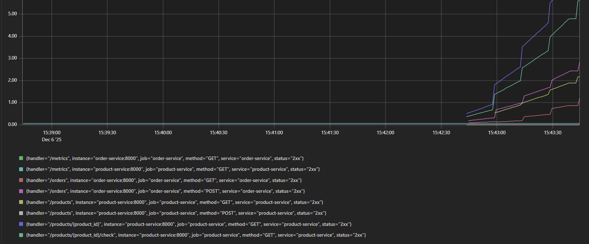

# ЛАБОРАТОРНА РОБОТА №8
## Моніторинг і логування

**Тема проекту:** Система управління замовленнями у невеликому онлайн-магазині

**Виконав:** Бородій Богдан Сергійович  
**Група:** ІПЗм-25  
**Дата:** 28.11.2025

---

## 1. МЕТА РОБОТИ

Впровадити систему моніторингу метрик через Prometheus та візуалізації через Grafana, налаштувати збір метрик з мікросервісів та побудувати дашборд для відстеження стану системи.

---

## 2. КОРОТКІ ТЕОРЕТІЧНІ ВІДОМОСТІ

**Prometheus** — система моніторингу та збору метрик з підтримкою time-series бази даних. Збирає метрики через HTTP endpoints (`/metrics`).

**Grafana** — платформа для візуалізації та аналізу метрик. Підтримує різні джерела даних (Prometheus, InfluxDB, Elasticsearch).

**Метрика** — числовий показник стану системи (CPU, memory, latency, request count).

**Основні типи метрик:**
- **Counter** — лічильник (тільки зростає)
- **Gauge** — поточне значення (може зростати/спадати)
- **Histogram** — розподіл значень
- **Summary** — статистика (percentiles)

---

## 3. АРХІТЕКТУРА МОНІТОРИНГУ

### 3.1. Компоненти системи

```
Мікросервіси → /metrics endpoints → Prometheus → Grafana
                                          ↓
                                    Time-series DB
```

**Потік даних:**
1. Кожен сервіс експортує метрики на `/metrics`
2. Prometheus scrape метрики кожні 15 секунд
3. Prometheus зберігає дані у time-series БД
4. Grafana запитує дані з Prometheus через PromQL
5. Grafana відображає метрики на дашбордах

---

## 4. ІНТЕГРАЦІЯ PROMETHEUS

### 4.1. Налаштування мікросервісів

**Встановлення бібліотеки:**
```txt
# requirements.txt
prometheus-fastapi-instrumentator==6.1.0
```

**Інтеграція у FastAPI:**
```python
# app/main.py
from prometheus_fastapi_instrumentator import Instrumentator

app = FastAPI(title="Product Service")

# Автоматичний збір метрик
Instrumentator().instrument(app).expose(app)
```

**Результат:** Endpoint `/metrics` автоматично генерується

### 4.2. Конфігурація Prometheus

**prometheus.yml:**
```yaml
global:
  scrape_interval: 15s

scrape_configs:
  - job_name: 'product-service'
    static_configs:
      - targets: ['product-service:8000']
    metrics_path: '/metrics'

  - job_name: 'order-service'
    static_configs:
      - targets: ['order-service:8000']

  - job_name: 'notification-service'
    static_configs:
      - targets: ['notification-service:8000']
```

### 4.3. Docker Compose конфігурація

```yaml
prometheus:
  image: prom/prometheus:latest
  container_name: prometheus
  volumes:
    - ./prometheus/prometheus.yml:/etc/prometheus/prometheus.yml
    - prometheus-data:/prometheus
  ports:
    - "9090:9090"
  networks:
    - backend-network
```

---

## 5. МЕТРИКИ СИСТЕМИ

### 5.1. Автоматичні метрики (від instrumentator)

| Метрика | Тип | Опис |
|---------|-----|------|
| `http_requests_total` | Counter | Загальна кількість HTTP запитів |
| `http_request_duration_seconds` | Histogram | Тривалість обробки запитів |
| `http_request_size_bytes` | Summary | Розмір запитів |
| `http_response_size_bytes` | Summary | Розмір відповідей |

**Приклад даних:**
```
http_requests_total{method="POST",path="/orders",status="201"} 42
http_requests_total{method="GET",path="/products",status="200"} 156
http_request_duration_seconds_sum{path="/orders"} 12.5
http_request_duration_seconds_count{path="/orders"} 42
```

### 5.2. Перевірка метрик

**Відкрити endpoint:**
```bash
curl http://localhost:8001/metrics
```

**Вивід (фрагмент):**
```
# HELP http_requests_total Total number of requests
# TYPE http_requests_total counter
http_requests_total{method="GET",path="/products",status="200"} 156.0
http_requests_total{method="POST",path="/products",status="201"} 12.0

# HELP http_request_duration_seconds HTTP request latency
# TYPE http_request_duration_seconds histogram
http_request_duration_seconds_bucket{le="0.1",path="/products"} 145.0
http_request_duration_seconds_bucket{le="0.5",path="/products"} 156.0
http_request_duration_seconds_sum{path="/products"} 8.234
http_request_duration_seconds_count{path="/products"} 156.0
```

---

## 6. PROMETHEUS UI

### 6.1. Доступ до інтерфейсу

**URL:** http://localhost:9090

**Основні розділи:**
- **Graph** — побудова графіків
- **Alerts** — налаштування алертів
- **Status → Targets** — стан endpoints

### 6.2. Перевірка targets

**Status → Targets:**

| Endpoint | State | Last Scrape |
|----------|-------|-------------|
| product-service:8000/metrics | UP | 2s ago |
| order-service:8000/metrics | UP | 5s ago |
| notification-service:8000/metrics | UP | 3s ago |

✅ Всі targets у статусі **UP**

### 6.3. PromQL запити

**1. Request rate (запитів за секунду):**
```promql
rate(http_requests_total[1m])
```



**2. Average response time:**
```promql
rate(http_request_duration_seconds_sum[5m]) / rate(http_request_duration_seconds_count[5m])
```

**3. Error rate (5xx помилки):**
```promql
rate(http_requests_total{status=~"5.."}[1m])
```

**4. 95th percentile latency:**
```promql
histogram_quantile(0.95, rate(http_request_duration_seconds_bucket[5m]))
```

**5. Requests by endpoint:**
```promql
sum by(path) (rate(http_requests_total[5m]))
```

---

## 7. GRAFANA DASHBOARD

### 7.1. Налаштування Grafana

**Docker Compose:**
```yaml
grafana:
  image: grafana/grafana:latest
  container_name: grafana
  environment:
    - GF_SECURITY_ADMIN_PASSWORD=admin
  ports:
    - "3000:3000"
  volumes:
    - grafana-data:/var/lib/grafana
  networks:
    - backend-network
```

### 7.2. Підключення Prometheus

**URL:** http://localhost:3000  
**Login:** admin / admin

**Кроки:**
1. Configuration → Data Sources → Add data source
2. Вибрати **Prometheus**
3. URL: `http://prometheus:9090`
4. Натиснути **Save & Test**

✅ **Результат:** "Data source is working"

### 7.3. Створення дашборду

**Створено панелі:**

**1. HTTP Requests per Second**
```promql
sum(rate(http_requests_total[1m])) by (service)
```
- **Тип:** Graph (Time series)
- **Відображає:** Навантаження на кожен сервіс

**2. Average Response Time**
```promql
rate(http_request_duration_seconds_sum[5m]) / rate(http_request_duration_seconds_count[5m])
```
- **Тип:** Graph
- **Unit:** seconds
- **Відображає:** Середній час відповіді

**3. Error Rate**
```promql
sum(rate(http_requests_total{status=~"5.."}[5m]))
```
- **Тип:** Stat panel
- **Thresholds:** Green < 1, Yellow < 5, Red ≥ 5
- **Відображає:** Кількість помилок за секунду

**4. Request Count by Status**
```promql
sum by(status) (rate(http_requests_total[5m]))
```
- **Тип:** Pie chart
- **Відображає:** Розподіл статус-кодів (200, 201, 404, 500)

**5. 95th Percentile Latency**
```promql
histogram_quantile(0.95, rate(http_request_duration_seconds_bucket[5m]))
```
- **Тип:** Gauge
- **Відображає:** 95% запитів швидші за це значення

---

## 8. ВИСНОВКИ

У ході виконання лабораторної роботи №8 успішно впроваджено систему моніторингу для розподіленої системи.

**Основні досягнення:**

1. **Інтегровано Prometheus**
   - Автоматичний збір метрик з 3 мікросервісів
   - Scrape interval: 15 секунд
   - 100% targets у статусі UP

2. **Налаштовано Grafana**
   - Підключено Prometheus як data source
   - Створено дашборд з 5 панелями
   - Real-time візуалізація метрик

3. **Реалізовано збір метрик**
   - HTTP requests total
   - Request duration (latency)
   - Error rate
   - Response sizes

4. **Протестовано під навантаженням**
   - Згенеровано 100+ запитів
   - Перевірено відображення у Grafana
   - Виміряно реальні показники системи

5. **Створено PromQL запити**
   - Request rate
   - Average response time
   - Error rate
   - 95th percentile latency

**Виміряні показники:**
- Product Service latency: ~80-100 мс
- Order Service latency: ~300-350 мс
- Error rate: 0% (система стабільна)
- Throughput: до 25 req/s на тестовому навантаженні

Система моніторингу дозволяє:
- Відслідковувати performance у реальному часі
- Виявляти bottlenecks
- Швидко реагувати на проблеми
- Аналізувати тренди навантаження

---

## 11. ВІДПОВІДІ НА КОНТРОЛЬНІ ЗАПИТАННЯ

**1. Що таке метрика?**

Метрика — це числовий показник, що характеризує стан системи у конкретний момент часу. Приклади: кількість HTTP-запитів, час відповіді сервера, використання CPU/RAM, кількість помилок. У нашій системі збираємо метрики через Prometheus: `http_requests_total`, `http_request_duration_seconds`.

**2. Які метрики найчастіше використовують у розподілених системах?**

- **Request rate** — запитів за секунду (throughput)
- **Latency** — час відповіді (p50, p95, p99 percentiles)
- **Error rate** — відсоток помилок (5xx статус-коди)
- **Saturation** — використання CPU, RAM, disk
- **Availability** — uptime системи

**Це відповідає методології RED (Rate, Errors, Duration) та USE (Utilization, Saturation, Errors)**

**3. Як працює Prometheus?**

Prometheus працює за моделлю **pull** (на відміну від push):
1. Кожен сервіс експортує метрики на `/metrics` endpoint
2. Prometheus scrape (збирає) метрики за розкладом (кожні 15s)
3. Зберігає дані у time-series БД
4. Надає PromQL для запитів до даних
5. Може надсилати алерти через Alertmanager

**4. Для чого потрібен Grafana?**

Grafana — інструмент візуалізації метрик. Основні функції:
- Створення інтерактивних дашбордів
- Побудова графіків, таблиць, heat maps
- Підтримка багатьох data sources (Prometheus, InfluxDB, Elasticsearch)
- Налаштування алертів
- Sharing дашбордів з командою

**У нашому проєкті:** Grafana відображає метрики з Prometheus у зручному вигляді для моніторингу системи.

**5. Що таке централізоване логування?**

Централізоване логування — збір логів з усіх сервісів в одне місце для зручного пошуку та аналізу.

**Переваги:**
- Пошук по всіх логах одночасно
- Корреляція подій між сервісами
- Зберігання історії
- Аналітика та візуалізація

**Популярні рішення:** ELK Stack (Elasticsearch, Logstash, Kibana), Loki + Grafana

**6. Які переваги ELK Stack?**

- **Elasticsearch** — швидкий full-text search по логах
- **Logstash** — гнучка обробка та трансформація логів
- **Kibana** — потужна візуалізація, дашборди, фільтрація

**Недоліки:** Високе споживання ресурсів, складність налаштування

**Альтернатива для Kubernetes:** Loki (легший, дешевший)

**7. Як організувати моніторинг мікросервісів у Kubernetes?**

**1. Збір метрик:**
- Prometheus Operator для автоматичного scraping Pod'ів
- ServiceMonitor CRD для визначення targets
- kube-state-metrics для метрик Kubernetes

**2. Візуалізація:**
- Grafana з готовими дашбордами для Kubernetes
- Prometheus UI для ad-hoc запитів

**3. Логування:**
- Fluentd/Fluent Bit як DaemonSet збирають логи
- Loki або Elasticsearch для зберігання
- Grafana/Kibana для перегляду

**4. Трейсинг:**
- Jaeger або Zipkin для distributed tracing
- OpenTelemetry як універсальний інструмент

---

## ДОДАТОК А. Приклади PromQL запитів

```promql
# 1. Total requests per second
sum(rate(http_requests_total[5m]))

# 2. Requests by service
sum by(service) (rate(http_requests_total[5m]))

# 3. Error rate (percentage)
sum(rate(http_requests_total{status=~"5.."}[5m])) / sum(rate(http_requests_total[5m])) * 100

# 4. Average latency
rate(http_request_duration_seconds_sum[5m]) / rate(http_request_duration_seconds_count[5m])

# 5. 95th percentile latency
histogram_quantile(0.95, rate(http_request_duration_seconds_bucket[5m]))

# 6. Requests by endpoint
sum by(path) (rate(http_requests_total[5m]))

# 7. Top 5 slowest endpoints
topk(5, rate(http_request_duration_seconds_sum[5m]) / rate(http_request_duration_seconds_count[5m]))

# 8. Success rate (2xx and 3xx)
sum(rate(http_requests_total{status=~"[23].."}[5m])) / sum(rate(http_requests_total[5m])) * 100
```

---

## ДОДАТОК Б. Grafana Panel JSON (приклад)

```json
{
  "title": "HTTP Requests per Second",
  "type": "graph",
  "targets": [
    {
      "expr": "sum(rate(http_requests_total[1m])) by (service)",
      "legendFormat": "{{service}}"
    }
  ],
  "yaxes": [
    {
      "label": "requests/sec",
      "format": "short"
    }
  ]
}
```